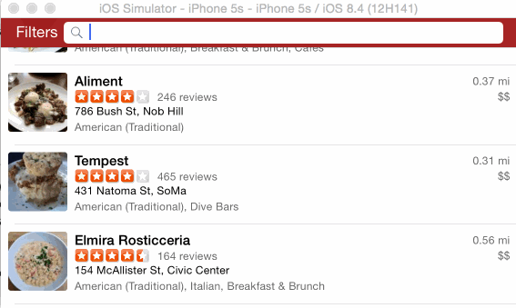

### Basic Yelp client

This is a headless example of how to implement an OAuth 1.0a Yelp API client. The Yelp API provides an application token that allows applications to make unauthenticated requests to their search API.

### Next steps

- Check out `BusinessesViewController.swift` to see how to use the `Business` model.

### Sample request

**Basic search with query**

```
Business.searchWithTerm("Thai", completion: { (businesses: [Business]!, error: NSError!) -> Void in
    self.businesses = businesses
    
    for business in businesses {
        println(business.name!)
        println(business.address!)
    }
})
```

**Advanced search with categories, sort, and deal filters**

```
Business.searchWithTerm("Restaurants", sort: .Distance, categories: ["asianfusion", "burgers"], deals: true) { (businesses: [Business]!, error: NSError!) -> Void in

    for business in businesses {
        println(business.name!)
        println(business.address!)
    }
}
```
## Yelp

This is a Yelp search app using the [Yelp API](http://developer.rottentomatoes.com/docs/read/JSON).

Time spent: `4`

### Features

#### Required

- [x] Search results page
   - [x] Table rows should be dynamic height according to the content height
   - [x] Custom cells should have the proper Auto Layout constraints
   - [x] Search bar should be in the navigation bar (doesn't have to expand to show location like the real Yelp app does).
- [x] Filter page. Unfortunately, not all the filters are supported in the Yelp API.
   - [x] The filters table should be organized into sections as in the mock.
   - [x] Used the default UISwitch for on/off states.
   - [x] Clicking on the "Search" button should dismiss the filters page and trigger the search w/ the new filter settings.
   - [x] Display some of the available Yelp categories (choose any 3-4 that you want).

### Walkthrough



